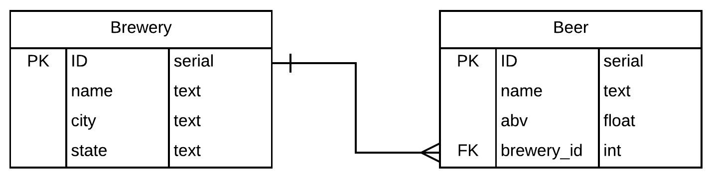

# Brews Knexfile

You will be implementing the following ERD with Knex.js:

NOTE: The only existing file in this repo you need to modify is `data/database_connection.js`, which should export a database connection to your database.

## Tasks

* Initialize this folder as a knex project
* Create *2 migrations* and *2 seeds* with the data available in the `/data` directory
  * You do not need to parse the CSV files, it is OK to copy/paste the values into a seed file.
* Export a database connection from `data/database_connection.js`
* Deploy the app and the database
